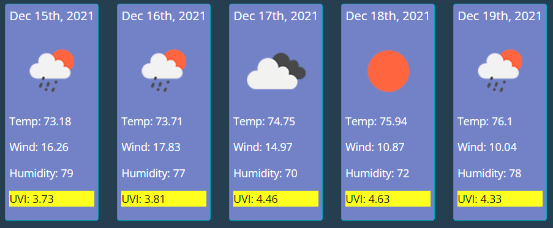

# weather-dashboard
Dashboard offering weather information by city

Requirements
------------

No specific requirements.

This application was developed using HTML, CSS & Javascript.

Installation
------------

No installation needed.
This is an online application for general weather information.

Usage
------------
You can access the application by clicking on the following link:

https://rargotte.github.io/weather-dashboard

There is only one screen to input the city and get the weather information.

On the left side of the screen you can see the search input field. Just type the city name and hit "enter" or click on the "search" button to get the weather information:

You have 8 slots to save in memory the previous cities for which you have already search. These are located below the "Search" button:

By clicking on any of the populated memory slots you will get immediate weather information on the right side of the screen.

On the top right side of the screen you will have current weather information on the city you input.

Below that information you will get a 5 days weather forcast on the same city:

## License
Copyright (c) 11/06/2021 _Regulo Argotte_